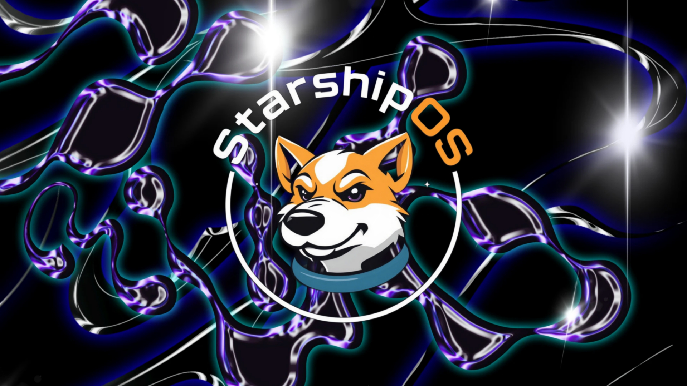

# Starship Operating System (StarshipOS)

Welcome to **Starship Operating System (StarshipOS)**! This project reimagines what an operating system can be—combining deep object-oriented principles with cutting-edge innovations in virtual memory management, unique process orchestration, and immersive user interaction. StarshipOS is not just an operating system; it’s a framework for a **new way of thinking**, focusing on flexibility, modularity, and empowering its users to build their "universe."

## Table of Contents

- [A Vision for Empowerment](#a-vision-for-empowerment)
- [Project Vision](#project-vision)
- [Key Features](#key-features)
- [Getting Started](#getting-started)
- [Technical Details](#technical-details)
- [Contributing](#contributing)
- [License](#license)

---

## A Vision for Empowerment

The **Starship Operating System** project is grounded not just in technological innovation but also in its potential for **transformative societal impact**. By providing a platform for education and skill-building in programming, **StarshipOS** aims to empower underserved communities—particularly those within the prison system. Teaching modern software development skills fosters rehabilitation and creates pathways to meaningful employment after release. This system is built for empowerment, growth, and creating new opportunities for all.

---

## Project Vision

We aim to create an operating system where every component is designed with **object-oriented principles** and tailored for **dynamic process orchestration**. StarshipOS redefines traditional OS architecture, ditching window managers, embracing virtual memory as the foundation, and prioritizing **file-agnostic object persistence**.

Envision a system where:

- The boot process ("Inflation Period") seamlessly hands off control to a **Groovy-based init system** using a DSL to fully manage initialization tasks.
- Processes are dynamically orchestrated via an **IPC-aware event bus** (instead of just thread management).
- The in-memory objects and lifecycle are governed by probabilistic models like **ANOVA** and **Bayesian inference**, building a computational "Standard Model" akin to physics.
- Users interact via a **JavaFX-powered 3D POV GUI** with direct framebuffer access to eliminate unnecessary layering, enabling a futuristic, immersive experience.

The result? A system designed to **expand human and machine creativity** while focusing on performance, modularity, and empowerment.

---

## Key Features

- **Groovy-DSL Init System**: A fully compiled init system, defined with a domain-specific language (DSL) to orchestrate the OS's initialization phase, handing off control to a **BundleManager**.
- **Dynamic Process Orchestration**: Processes—**not threads**—are brought in and out of existence dynamically using an **IPC-aware event bus and loop**.
- **Apache Felix Bundles**: StarshipOS tightly integrates with **Felix OSGi bundles**, enabling runtime dependency management and modular applications.
- **Virtualized Memory Model**: A custom swap partition for heaping Java instances treats memory as a dynamic, **file-agnostic, object-oriented structure**. Persistence is managed probabilistically via entropy models.
- **Cosmic Design Principles**: StarshipOS models runtime behaviors on modern physics concepts, including the "Big Bang" (booting/inflation) and "Standard Model" analogs—objects as particles, messaging as forces.
- **JavaFX 3D GUI**: A **direct framebuffer-access-based GUI**, bypassing traditional window managers to deliver a **point-of-view immersive interface**.
- **Interactive Java Shell**: As early as boot, the system launches `jshell` or `other` for interactive scripting and exploration.

---

## Getting Started

### Prerequisites

- **sudo** is required to build and run the system.
- A Linux build environment with tools such as **GCC**, **Make**, and others.

### Build Instructions

To manage and build the project, utilize the `cleanbuild.sh` script in the `./bin/` directory. This script is designed to streamline the Maven build process for this multi-module project by providing flexibility with module-specific builds, cleanups, force builds, and logging.

#### Usage and Options

Run the `cleanbuild.sh` script with any of the following options:

```bash
./bin/cleanbuild.sh [OPTIONS]
```

**Available Options:**

- **`-h` or `--help`**  
  Displays the help menu with detailed usage instructions.

- **`-l` or `--logfile FILE`**  
  Specify a log file (default: `build.log`).

- **`--uber-clean`**  
  Removes `build` directories for all modules and forces a full rebuild.

- **`--debug`**  
  Enables debug output (`mvn -X` targets) and introduces debug breakpoints for deeper inspection during the build process.

- **`--clean MODULE`**  
  Removes the `build` directory for a specific module. This forces its rebuild during the next build.

- **`--force MODULE`**  
  Removes the `build` directory of the specified module and rebuilds it *immediately* (without rebuilding other modules).

#### Examples

- **Perform a standard build:**  
  This command builds the project, only cleaning and rebuilding modules needing it, including always-rebuilt modules (e.g., `grub`, `initramfs`, `qcow2_image`).

  ```bash
  ./bin/cleanbuild.sh
  ```

- **Force a complete rebuild (all modules):**  
  Clean `build` directories for all modules and rebuild everything from scratch:

  ```bash
  ./bin/cleanbuild.sh --uber-clean
  ```

- **Clean and rebuild a single module:**  
  For example, to clean the `kernel` module and include it in the next build:

  ```bash
  ./bin/cleanbuild.sh --clean kernel
  ```

- **Force rebuild a single module immediately:**  
  Clean and rebuild just the `qcow2_image` module right away, without building any other modules:

  ```bash
  ./bin/cleanbuild.sh --force qcow2_image
  ```

- **Enable debug mode:**  
  Run Maven with debug flags (`-X`) and include custom breakpoint functionality:

  ```bash
  ./bin/cleanbuild.sh --debug
  ```

#### Logging

All build output is logged to a file (default: `build.log`). You can specify your own file using the `-l` or `--logfile` option:

```bash
./bin/cleanbuild.sh -l my_custom_logfile.log
```

---

## Build Philosophy

This script is designed to be the core of the build process for **StarshipOS**. It utilizes Maven's root-level reactor to manage dependencies and builds while ensuring:

- Specific modules, such as `qcow2_image`, are always rebuilt to maintain consistency.
- Non-essential modules are skipped unless explicitly cleaned for optimal build performance.
- Debugging and log tracking are provided to simplify troubleshooting during complex builds.

---

## Technical Details

1. **Custom Init System**: Written in Groovy, consuming a DSL to initialize system components. Hands control to the `BundleManager`.
2. **Event-Driven System Init**: IPC-aware event loop dynamically manages processes via Apache Felix and resolves dependencies on the fly.
3. **Advanced Virtual Memory Model**: Uses JVM ZGC to manage memory entropy and swap out objects dynamically based on probabilistic models.
4. **Point-of-View GUI**: The **JavaFX-based 3D GUI** renders directly via the framebuffer, eliminating the need for a window manager.

---

## Contributing

We welcome contributions! Please refer to our [Contribution Guide](CONTRIBUTING.md) to get involved in developing **StarshipOS**.

---

## License

This project is dual-licensed under the terms of the **GPLv2** and the **Apache License 2.0**. You may choose either of these licenses to comply with your use case.

For GPLv2, see [LICENSE-GPLv2](LICENSE-GPLv2).  
For Apache 2.0, see [LICENSE-APACHE](LICENSE-APACHE).

---